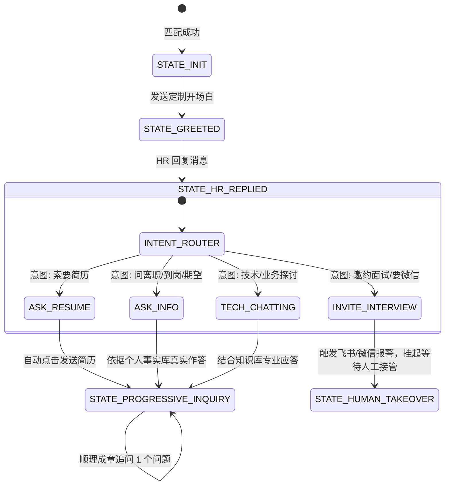

# 03. 多轮沟通状态机、基础信息摸底与自定义追问规范

本文档定义了 AI Agent 代替求职者与 HR 进行多轮沟通时的**对话状态机（FSM）**、**5 项基础信息核实机制**以及**职位/岗位级自定义追问引擎**的设计。

---

## 一、 对话状态机（FSM）生命周期



---

## 二、 5 大基础工作信息摸底清单（AI 必问底线）

AI 在沟通进入平稳期时，会根据对话节奏逐步摸清以下关键基础信息，防止求职者入职踩坑：

| 维度 | 核实目标与底线要求 | AI 建议提问话术示例 |
| :--- | :--- | :--- |
| **1. 薪资结构** | 确认 Base 占比、绩效考核机制、年终奖基数（12薪 vs 15/16薪） | *“请问咱们岗位的薪资构成大概是怎样的呢？是否有固定的绩效或年终比例呢？”* |
| **2. 试用期保障** | 确认试用期月数（通常3~6个月）、试用期薪资是否 100%、是否入职首月即全额缴纳五险一金 | *“请问试用期一般是几个月呢？入职当月五险一金是全额基数缴纳吗？”* |
| **3. 工作时间与考勤** | 确认 965/996/大小周、弹性打卡时间、加班是否有调休或加班补贴 | *“请问咱们平时的作息时间是怎样的呢？会有大小周或者固定加班情况吗？”* |
| **4. 业务模式属性** | 严防“挂羊头卖狗肉”的外派，确认是否为纯自研核心产品业务 | *“了解咱们这个岗位负责的是公司内部自研的核心业务，还是针对外部客户的定制交付项目呀？”* |
| **5. 办公地点与出差** | 确认是否为常驻固定工位，是否需要高频跨城市出差 | *“请问后续日常办公是在 JD 标注的园区工位吗？平时会有频繁出差的需求吗？”* |

---

## 三、 自定义追问引擎设计（模板级 + 岗位级）

在 `config/inquiry_templates.yaml` 中，用户可配置不同层次的追问规则：

### 1. 职位类别级（Category Level）
根据岗位所属类别，自动挂载专属技术与业务提问列表：

*   **`AI_Agent_Engineer` (大模型/Agent 工程师)**：
    1. *“请问咱们团队目前重点探索的是 RAG 知识库、工作流 Agent，还是垂直领域的模型微调呢？”*
    2. *“咱们业务主要是基于主流商业闭源 API（如 DeepSeek/Claude），还是有自建私有化开源模型（如 Qwen/Llama）集群呀？”*
*   **`Backend_Architect` (后端开发/架构师)**：
    1. *“请问目前核心系统的数据量和 QPS 峰值大概在什么量级呢？主要采用的是微服务还是模块化单体架构？”*
*   **`Frontend_Engineer` (前端开发)**：
    1. *“请问咱们目前的前端技术栈主要是 Vue3 还是 React 生态？是否有比较重的前端交互或可视化组件库定制需求呢？”*

### 2. 单岗位/公司级专属覆写（Job Level Override）
针对特定高意向公司或特别关注的岗位，直接在配置中指定必问问题：
```yaml
job_overrides:
  - company_keyword: "字节跳动"
    must_ask:
      - "请问该岗位具体对应哪个业务线（如抖音、电商、飞书还是海外业务）？"
```

---

## 四、 渐进式多轮拟人化提问策略（Progressive Dialogue Policy）

为了防止 HR 产生被“审问”的抵触情绪，Prompt 强制执行以下交互原则：

1. **单次提问严格 $\le 1$ 个**：每次回复 HR 时，先针对 HR 的问题给出清晰回答，再**顺带、委婉地抛出 1 个想了解的信息**。
2. **礼貌友好、专业不生硬**：使用“想向您请教一下”、“了解一下咱们这边”等温和语气词。
3. **完成度追踪 (Slot Filling)**：已获取到答案的维度标记为 `RESOLVED`，不再重复提问；尚未获取的按优先级在后续轮次中逐步补充。
4. **人工接管熔断**：一旦 HR 提出约面试、要电话、要加微信，或者表现出不耐烦，**AI 立即停止追问，发送通用礼貌应答并即刻通知人工接管**。
