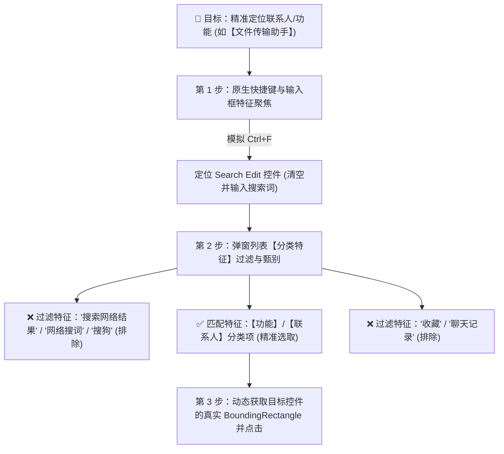

# 🖥️ 微信桌面自动化：特征驱动与动态自适应控制准则 (Feature-Driven UI Rules)

> [!IMPORTANT]
> **核心原则**：严禁依赖固定像素死坐标！界面可能在不同屏幕分辨率、DPI 缩放比例（100%/125%/150%/200%）及窗口拉伸下发生位移。
> **Agent 实操时必须以【控件语义特征】、【分类层级特征】与【动态包围盒 (BoundingRectangle)】为唯一准则！**

---

## 1. 核心控件特征识别规则

---

## 2. 详细特征甄别表

| 界面区域 | 控件特征 / 语义名称 | 判定条件 | Agent 动作 |
| :--- | :--- | :--- | :--- |
| **搜索入口** | `EditControl` / 搜索框 | 位于左上方，占位符包含 `搜索` | 模拟 `Ctrl+F` 原生聚焦或点击其中心 |
| **网络搜词区** | `搜索网络结果` 下属项 | 图标为放大镜 🔍，文字含拓展搜词 | **🚫 严格跳过 / 严禁点击** |
| **真实目标区** | **`功能` / `联系人`** 分类项 | **🟢 绿色文件夹图标（文件传输助手）或好友真实头像** | **✅ 精准命中：读取其实时坐标点击** |
| **历史记录区** | `收藏` / `聊天记录` 分类项 | 描述包含 `来自: ...` 或 `的聊天记录` | **🚫 严格跳过 / 严禁点击** |
| **聊天输入框** | `EditControl` / 消息输入区 | 位于聊天会话右侧底部区域 | 动态获取输入框中心点并点击聚焦 |

---

## 3. 多层级动态定位执行策略（优先级从高到低）

### 🥇 策略一：UI Automation 语义树动态解析（最稳健）
* 通过 Windows Accessibility 接口遍历微信窗口内部子控件；
* 查找 `Name="文件传输助手"` 或目标好友名称，且父级/同级不属于“搜索网络结果”的 `ListItem` 控件；
* 动态读取该控件的 `BoundingRectangle.GetCenter()` 进行精准物理点击或直接调用 `Invoke()`。

### 🥈 策略二：键盘语义导航（原生事件流）
* `Ctrl + F` 唤醒搜索 ➔ 输入名称；
* 通过键盘方向键 `Down` 步进至非网络搜索的【功能/联系人】首项并敲击 `Enter`。

### 🥉 策略三：动态比例与 DPI 补偿计算（兜底保障）
* 实时调用 `GetDpiForWindow` / `GetWindowRect` 获取微信窗口的实时物理像素；
* 根据弹窗中各分类区域的相对比例进行动态偏移计算，绝对不使用死像素。
